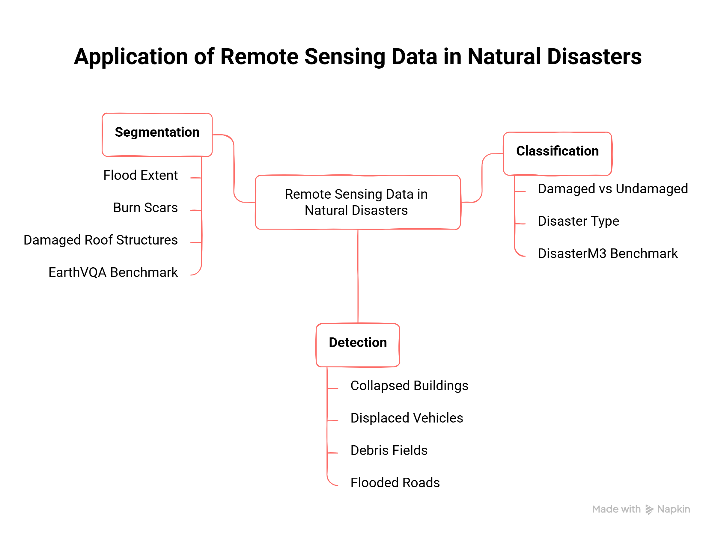

# Computer Vision Tasks

## Overview

Computer vision is the field of AI that enables machines to interpret and understand visual information from images or videos. The three foundational tasks are **classification**, **detection**, and **segmentation**.

---

## 1. Image Classification

**What it does:** Assigns a single label to an entire image.

**Question it answers:** *"What is in this image?"*

**Output:** A category label (e.g., "flooded area", "fire", "collapsed building")

**Example:** Given a satellite image, the model outputs: `damaged` or `not damaged.`

**Key characteristic:** The model does not care *where* in the image the object is only *what* is present.

---

## 2. Object Detection

**What it does:** Identifies *what* objects are in an image and *where* they are, using bounding boxes.

**Question it answers:** *"What is in this image, and where exactly?"*

**Output:** A set of bounding boxes, each with a class label and a confidence score.

**Example:** Given a satellite image after an earthquake, the model draws boxes around each collapsed building and labels them.

**Key characteristic:** Provides location information (x, y, width, height of each detected object).

---

## 3. Image Segmentation

**What it does:** Labels every single pixel in the image with a class.

**Question it answers:** *"What category does each pixel belong to?"*

**Output:** A pixel-level mask, each pixel is assigned a class.

There are two main types:
- **Semantic segmentation:** Every pixel of the same class gets the same label (e.g., all water pixels = blue, all road pixels = gray)
- **Instance segmentation:** Distinguishes between individual objects of the same class (e.g., building #1 vs building #2)

**Example:** Given a flood satellite image, the model colors every flooded pixel in blue, every road pixel in gray, and every building pixel in red.

**Key characteristic:** Most detailed of the three tasks provides shape-level information for every object.

---

